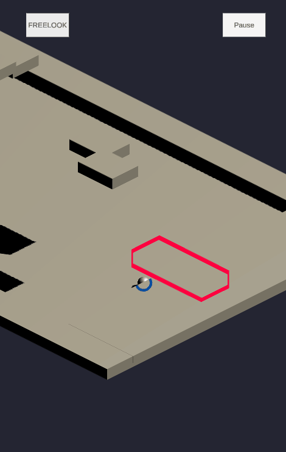

# IsometricGolfMobileGame
simple golf game with isometric camera angle made in unity
## Demo
### shooting

  
  

 `dragging the screen gives the ball direction and speed.`
 
---

### freelook

  

 `it displays a controller for the user to control the camera positon.`

---
